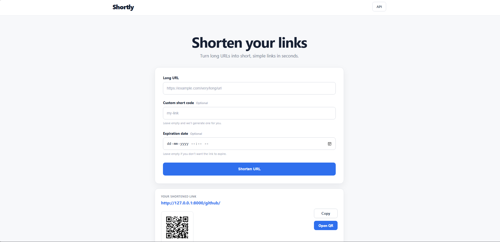

# Shortly — URL Shortener

A simple URL shortening service built with Django and Django REST Framework.

Shortly allows users to create short links, use custom short codes, set expiration dates, track link visits, and generate QR codes through a simple web interface and REST API.

## Preview



## Features

- Generate unique short URLs
- Custom short codes
- Optional link expiration
- Redirect short URLs to their original destination
- Track link visits
- Generate QR codes
- Search and order shortened URLs
- Paginated URL listing
- API and public endpoint rate limiting
- QR code caching
- Command to clean up expired links
- Responsive web interface
- Automated tests

## Tech Stack

- Python
- Django 6.0
- Django REST Framework
- SQLite
- HTML, CSS & JavaScript
- qrcode & Pillow

## Getting Started

Clone the repository:

```bash
git clone https://github.com/aryan-viii/Url_shortener.git
cd Url_shortener
```

Create and activate a virtual environment:

```bash
python -m venv venv
```

**Windows**

```bash
venv\Scripts\activate
```

**macOS / Linux**

```bash
source venv/bin/activate
```

Install dependencies:

```bash
pip install -r requirements.txt
```

Apply migrations:

```bash
python manage.py migrate
```

Start the development server:

```bash
python manage.py runserver
```

Open:

```text
http://127.0.0.1:8000/
```

## API Endpoints

| Method | Endpoint | Description |
|---|---|---|
| `GET` | `/api/shorten/` | List shortened URLs |
| `POST` | `/api/shorten/` | Create a short URL |
| `GET` | `/api/shorten/<short_code>/` | Retrieve a short URL |
| `PUT/PATCH` | `/api/shorten/<short_code>/` | Update a short URL |
| `DELETE` | `/api/shorten/<short_code>/` | Delete a short URL |
| `GET` | `/api/shorten/<short_code>/stats/` | View link statistics |
| `GET` | `/api/shorten/<short_code>/qr/` | Generate a QR code |
| `GET` | `/<short_code>/` | Redirect to the original URL |

The list endpoint also supports search, ordering, and pagination:

```text
/api/shorten/?search=youtube
/api/shorten/?ordering=-access_count
/api/shorten/?page=2
```

## Example

Create a short URL:

```bash
curl -X POST http://127.0.0.1:8000/api/shorten/ \
  -H "Content-Type: application/json" \
  -d '{"url": "https://example.com"}'
```

You can optionally provide a custom short code and expiration date:

```json
{
    "url": "https://example.com",
    "short_code": "example",
    "expires_at": "2026-12-31T23:59:59Z"
}
```

## Running Tests

```bash
python manage.py test
```

## Cleaning Up Expired Links

Delete expired links:

```bash
python manage.py purge_expired_links
```

Preview what would be deleted:

```bash
python manage.py purge_expired_links --dry-run
```

## Development Notes

This project is configured for local development.

Before deploying publicly, configure environment variables for sensitive settings, disable debug mode, set allowed hosts, and use an appropriate production cache/database configuration.